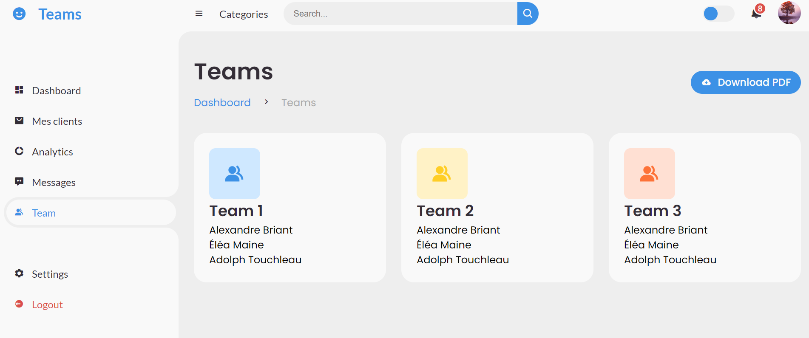

# ECE PHP B2 Project
A repository designated to the ECE B2 S2 PHP project, a PHP project aiming to recreate a digital consulting service web platform. With Belaid IOUDJAOUDENE.

SQL, HTML5, CSS3, and PHP were used. 

